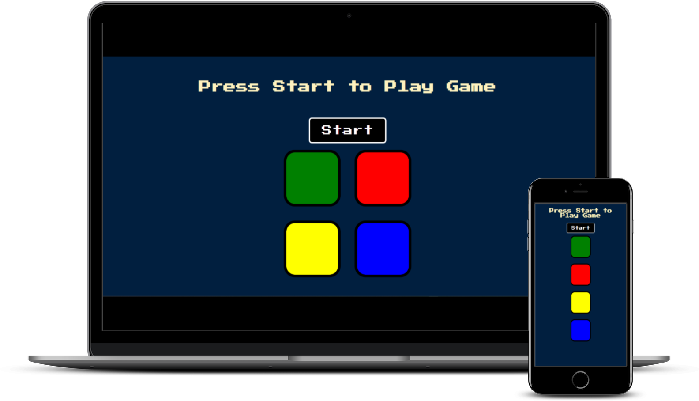

# Simon Game

Similar to the game you may have played as a kid. Copy the pattern of buttons to press until a wrong button pressed results in game over with the option to restart.

## Project Details

### View My Project: [https://ll-zerr.github.io/simon-game/](https://ll-zerr.github.io/simon-game/)

## Features

- Animated buttons each with unique sounds
- Level up counter to reveal progress
- Distinct game over notification
- Option to restart and try again

## Technologies Used

- jQuery
- Javascript
- HTML5
- CSS3

## Acknowledgements

Project Idea: Dr. Angela Yu [The Complete 2023 Web Development Bootcamp - Udemy course](https://www.udemy.com/course/the-complete-web-development-bootcamp/?src=sac&kw=the+Complete+2023)

Original HTML, CSS & Sounds provided by: Dr. Angela Yu [The Complete 2023 Web Development Bootcamp - Udemy course](https://www.udemy.com/course/the-complete-web-development-bootcamp/?src=sac&kw=the+Complete+2023)